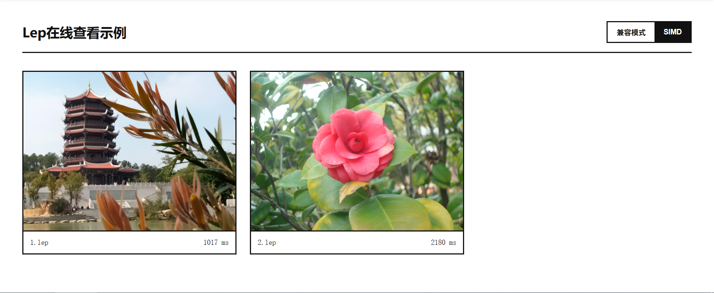

```markdown
# Lepton WASM

[简体中文](./README.md) | [English](./README.EN.md)

Lepton is a lossless JPG compression tool developed by Dropbox that can reduce file sizes by approximately 20% without any loss in image quality. **Lepton WASM** is a WebAssembly version based on Microsoft's open-source [lepton_jpeg_rust](https://github.com/microsoft/lepton_jpeg_rust) (a Rust port of Dropbox Lepton), designed to provide high-performance image compression and instant preview capabilities directly in the browser.


## Features

- Restore `.lep` to `.jpg` directly in the browser frontend with zero quality loss.
- Supports WASM SIMD (128-bit) instruction set, increasing decoding speed by approximately 25%.
- Provides two build options: "Viewer Only" and "Full Version".




## 1. Quick Build

### Prerequisites
- **Rust Toolchain** (1.89 or higher)
- **wasm-pack**: Used for compiling and packaging WASM.
    ```bash
    cargo install wasm-pack
    ```

### Manual Build Options
| Version | Functionality | Build Command |
| :--- | :--- | :--- |
| Viewer | Decoding .lep files only | `wasm-pack build --target web -- --features viewer` |
| Full | Encoding & Decoding | `wasm-pack build --target web -- --features full` |

---

## 2. Performance and SIMD Acceleration

Since WASM runs in a virtual machine environment, it cannot directly use the x86 AVX instruction set. This project utilizes **WASM SIMD (128-bit)** to achieve hardware acceleration:

```bash
RUSTFLAGS="-C target-feature=+simd128" wasm-pack build --target web
```

> **Tips**: It is recommended to distribute two versions of the `.wasm` file. Use `wasm-feature-detect` in JavaScript to detect the environment and dynamically load either the SIMD or the compatibility version for optimal performance.

---

## 3. Frontend Integration Guide

### Basic API

```javascript
import init, { lep_to_jpg, jpg_to_lep, get_version } from './pkg/lepton_wasm.js';

async function run() {
    await init(); // Initialize WASM module

    // .lep -> .jpg
    const jpgData = lep_to_jpg(lepUint8Array);
    const blob = new Blob([jpgData], { type: 'image/jpeg' });
    document.getElementById('my-img').src = URL.createObjectURL(blob);
}
```

The generated "glue code" provides the following core interfaces:

- `init()`: Initializes the WASM module. **Must** be called before use.
- `lep_to_jpg(data: Uint8Array) -> Uint8Array`: 
  - Input: Binary array of the .lep file.
  - Output: Binary array of the .jpg file.
- `jpg_to_lep(data: Uint8Array) -> Uint8Array`: (Full version only)
  - Input: Binary array of the .jpg file.
  - Output: Binary array of the .lep file.
- `get_version()`: Returns the core library version.

### Multi-threaded Processing (Web Worker)

Decoding is a computationally intensive task. Running it directly on the main thread will cause the UI to freeze, preventing users from interacting with the page until all images are decoded. It is strongly recommended to call the decoding interface within a **Web Worker**:
1. The main thread sends the `.lep` binary data to the Worker.
2. The Worker calls `lep_to_jpg` in the background.
3. The Worker sends the result back to the main thread for rendering.

---

## 4. Demo

[WebAssembly SIMD Detection](https://page.hcyhub.com/%E5%B0%8F%E5%B7%A5%E5%85%B7/SIMD%E6%94%AF%E6%8C%81%E6%80%A7%E6%A3%80%E6%B5%8B/)

[Lep Online Viewer Demo](https://page.hcyhub.com/%E5%B0%8F%E5%B7%A5%E5%85%B7/Lepton%20Web/DemoLepViewer/)

[Lepton Online Lossless Compression/Decompression Demo](https://page.hcyhub.com/%E5%B0%8F%E5%B7%A5%E5%85%B7/Lepton%20Web/DemoTinyLep/)

You can refer to the implementations in the `DemoLepViewer` and `DemoTinyLep` directories. By using Web Components, developers can display compressed images as easily as this:

```html
<lep-img src="images/vacation.lep"></lep-img>
```

---

## The Lepton Utility Toolkit

To achieve the best experience with Lepton—retaining small file sizes while maintaining a seamless JPG-like viewing experience—you can download the following toolkit:

1. **[TinyLep](https://github.com/2010HCY/TinyLep)**: A batch lossless JPG compression tool. Drag and drop files or folders to compress.
2. **[LepViewer](https://github.com/2010HCY/LepViewer)**: Instantly preview `.lep` files just like regular images without manual decompression.
3. **[LepThumb](https://github.com/2010HCY/LepViewer/tree/main/LepThumb)**: A Windows Explorer thumbnail plugin to preview `.lep` thumbnails directly in folders.
4. **LeptonWASM**: This project, which enables websites or web applications to natively support the previewing and processing of the Lepton format.

---

## Acknowledgments

This project utilizes Dropbox Lepton. Special thanks to the **Microsoft Team** for open-sourcing the Rust port and refactoring of the Lepton tool: [lepton_jpeg_rust](https://github.com/microsoft/lepton_jpeg_rust).

## Donations

If these tools are helpful to you, feel free to support the project:

